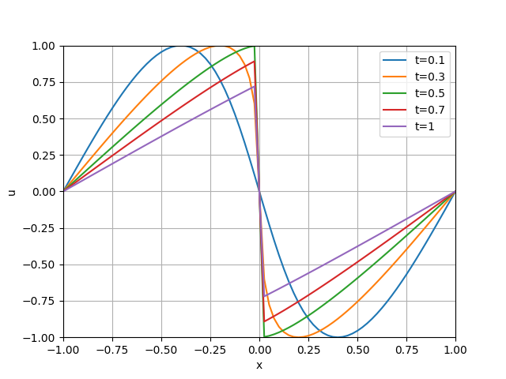

(burger)=

# The Analytical Solution to the Inviscid Burger's Equation

The inviscid burger's equation is a representative of the nonlinear hyperbolic partial differential equations (PDEs), with formula
```{math}
\frac{\partial u}{\partial t}+\frac{\partial}{\partial x}\left(\frac{u^2}{2}\right)=0,
```

initial condition

$$u(x,0)=-\sin(\pi x)$$

and boundary condition

$$u(-1,t)=0\quad u(1,t)=0.$$

The analytical solution can be derived using the method of characteristics. 

First, rewrite the PDE as 

$$\frac{\partial u}{\partial t}+u\frac{\partial u}{\partial x}=0$$

Then the left hand side can be rewritten as the total derivative of $u(x,t)$, that is,

$$\frac{\mathrm{d}u}{\mathrm{d}t}=\frac{\partial u}{\partial t}+\frac{\partial x}{\partial t}\frac{\partial u}{\partial x}=0.$$

Hence $u$ is constant along the characteristics 

$$\frac{\partial x}{\partial t}=u.$$

Given $u_0$ on $(x_0,0)$, we have, along the characteristic,

$$x_0- u_0\cdot 0=x-u_0t=x+\sin(\pi x_0)t.$$

Therefore, any $u(x,t)$ can be derived by first solving the equation

$$x_0=x+\sin(\pi x_0)t,$$

for $x_0$ and then

$$u(x,t)=-\sin(\pi x_0).$$

```{note}
It should be noted that the solutions of nonlinear hyperbolic PDEs are typically spatially discontinuous.

In this example, a shock formulates at

$$t_b=-\frac{1}{\min_{x\in R}u'_0(x)}=-\frac{1}{\min_{x\in R}-\pi\cos(\pi x)}=\frac{1}{\pi}\approx0.31831$$

and

$$x_s=\frac{1}{2}(u_L+u_R)=0,$$ 

since the initial condition is symmetric about $x=0$.
```

The following codes illustrate the evolution of the shock.
```python
import numpy as np
from Solverz import Var, Param, Eqn, made_numerical, sin, Model, nr_method

import matplotlib.pyplot as plt
# %% modelling
m = Model()
m.x = Var('x', 0)
m.t = Param('t', 0.3)
m.x1 = Param('x1', -0.1)
m.f = Eqn('f', m.x - sin(np.pi * m.x) * m.t - m.x1)
sae, y0 = m.create_instance()
ae, code = made_numerical(sae, y0, output_code=True, sparse=True)
# %% solution
X = np.linspace(-1, 1, 81)
U = np.zeros((81, 5))
t_range = [0.1, 0.3, 0.5, 0.7, 1]
tshock = 0.31831
for j in range(5):
    ae.p['t'] = t_range[j]
    for i in range(X.shape[0]):
        ae.p['x1'] = X[i]
        if t_range[j] < tshock:
            sol = nr_method(ae, y0)
            U[i, j] = -np.sin(np.pi * sol.y['x'])[0]
        else:
            if X[i] > 0:
                y0['x'] = 1
                sol = nr_method(ae, y0)
                U[i, j] = -np.sin(np.pi * sol.y['x'])[0]
            elif X[i] < 0:
                y0['x'] = -1
                sol = nr_method(ae, y0)
                U[i, j] = -np.sin(np.pi * sol.y['x'])[0]
            else:
                U[i, j] = 0

# %% visualize
plt.plot(X, U, label=[f"t={arg}" for arg in t_range])
plt.xlabel('x')
plt.ylabel('u')
plt.xlim([-1, 1])
plt.ylim([-1, 1])
plt.legend()
plt.grid()
plt.show()
```
Finally, we have

