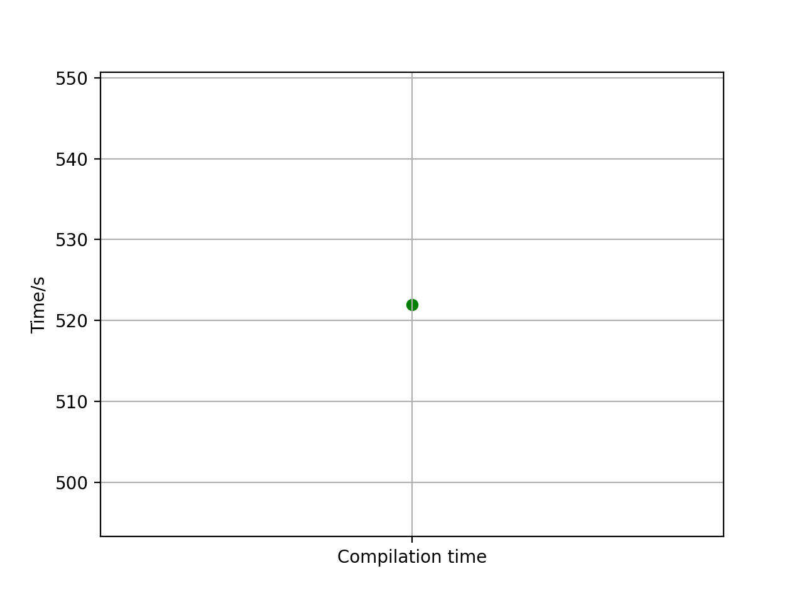
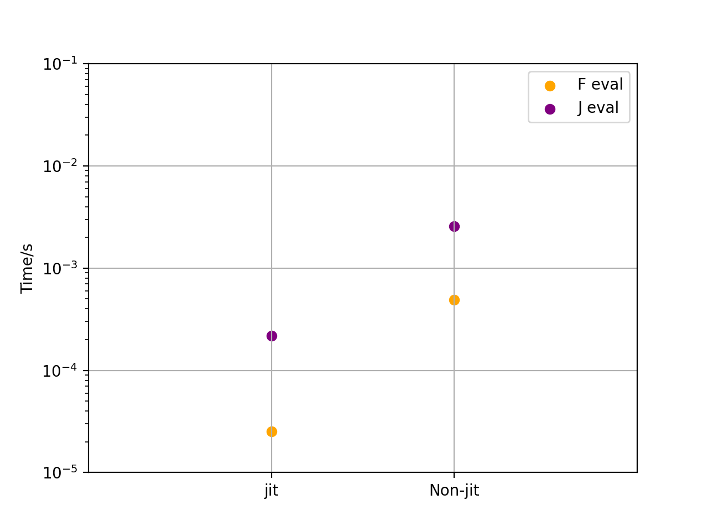
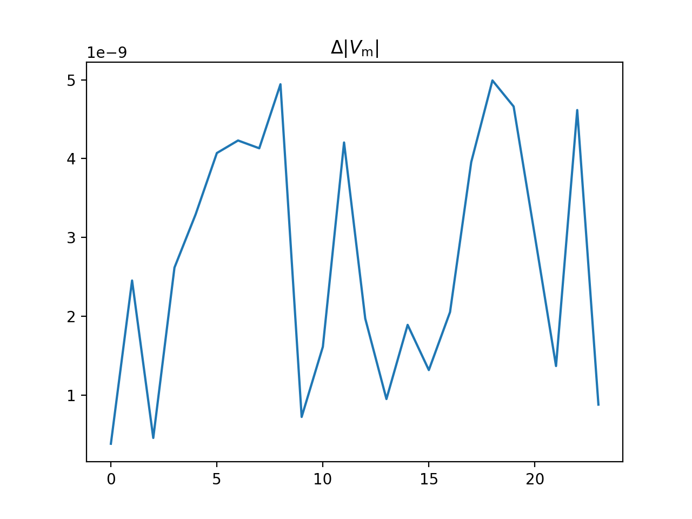

(pf)=

# The Calculation of Electric Power Flow

*Author: [Ruizhi Yu](https://github.com/rzyu45)*

Power flow is fundamental in electric power system analysis. Given electric load and generation, we want to calculate 
the bus voltage and the power distribution[^book1].

In this example, we illustrate how to use Solverz to symbolically model the power flow and then perform the power flow
analysis.

## Model

The power flow models are equations describing the injection power of electric buses, with formulae

```{math}
\left\{
\begin{aligned}
&p_h=v_h\sum_{k}v_k\qty(g_{hk}\cos\theta_{hk}+b_{hk}\sin\theta_{hk}),\quad i\in\mathbb{B}_\text{pv, pq}\\
&q_h=v_h\sum_{k}v_k\qty(g_{hk}\sin\theta_{hk}-b_{hk}\cos\theta_{hk}),\quad i\in\mathbb{B}_\text{pv}\\
\end{aligned}
\right.
```

where $p_h$ and $q_h$ are respectively the active and reactive injection power of bus $h$; $v_h$ is the voltage magnitude of bus $h$; $\theta_{hk}=\theta_h-\theta_k$ is the voltage angle difference between bus $h$ and $k$; $g_{hk}$ and $b_{hk}$ are the $(h, k)$-th entry of the conductance and susceptance matrices; $\mathbb{B}$ is the set of bus indices with the subscripts being the bus types.

The buses in electric power systems are typically sparsely connected, and hence the Jacobian of power flow models are always sparse. In what follows, we will set the `sparse` flag to be `True`.

## Implementation in Solverz

### Power flow modelling

We use the `case30` from the [matpower](https://matpower.org/) library. The required data for verification can be found in case file directory of the [source repo](https://github.com/rzyu45/Solverz-Cookbook).

We first perform the symbolic modelling of the `case30` power flow. 

```{literalinclude} src/pf_mdl.py
```

We use the `module_printer` to generate two independent python modules `powerflow` and `powerflow_njit` with the `jit` flag being `True` and `False` respectively. 

After *printing* the modules, we can just import these modules and call the `F` and `J` functions to evaluate the power flow model and its Jacobian.

```python
from powerflow import mdl as pf, y as y0
F0 = pf.F(y0, pf.p)
J0 = pf.J(y0, pf.p)
```

### Jit acceleration

The above power models have the $\sum$ symbols, which bring about burdensome for-loops. As a potent way to eliminate the for-loops and accelerate calculations, we ought to use the llvm-based Numba package to fully take advantage of the `SMID` in CPUs. It should be noted that Solverz can print numerical codes compatible for Numba integration by setting `jit=True`. 

We show the computation overhead between two `jit` settings using the following figures.





On a laptop equipped with Ryzen 5800H CPU, it took hundreds of seconds to compile the module `powerflow`. However, the post-compiled `F` and `J` function evaluations were one magnitude faster than those without jit-compilation. 

The compiled results are cached locally, so that only one compilation is required for each model. We recommend that one debug one's models without jit and compile the models in efficiency-demanding cases.

## Matrix-form power flow with `Mat_Mul`

Since version 0.8.0, Solverz supports a compact matrix-vector formulation of power flow using `Mat_Mul`. Instead of element-wise for-loops, we express the power injection equations in rectangular coordinates ($e$, $f$) using matrix-vector products:

```{math}
\left\{
\begin{aligned}
&\mathbf{p}=\mathbf{e}\odot(\mathbf{G}\mathbf{e}-\mathbf{B}\mathbf{f})+\mathbf{f}\odot(\mathbf{B}\mathbf{e}+\mathbf{G}\mathbf{f})\\
&\mathbf{q}=\mathbf{f}\odot(\mathbf{G}\mathbf{e}-\mathbf{B}\mathbf{f})-\mathbf{e}\odot(\mathbf{B}\mathbf{e}+\mathbf{G}\mathbf{f})
\end{aligned}
\right.
```

where $\mathbf{G}$ and $\mathbf{B}$ are the conductance and susceptance matrices (sparse), and $\odot$ denotes element-wise multiplication.

Solverz automatically computes the symbolic Jacobian via {ref}`matrix calculus <matrix_calculus>`. For example, the Jacobian of the active power equation w.r.t. $\mathbf{e}$ is:

```{math}
\frac{\partial\mathbf{p}}{\partial\mathbf{e}}=\operatorname{diag}(\mathbf{G}\mathbf{e}-\mathbf{B}\mathbf{f})+\operatorname{diag}(\mathbf{e})\mathbf{G}+\operatorname{diag}(\mathbf{f})\mathbf{B}
```

The implementation for the `case30` system:

```{literalinclude} src/pf_matmul.py
```

Starting from a flat start ($e=1$, $f=0$), the Newton-Raphson method converges in 4 iterations.

```{note}
The `Mat_Mul` formulation is much more compact than the for-loop approach — the entire power flow model is defined in just a few lines. The Jacobian is computed automatically by the matrix calculus engine, eliminating the need for manual derivation.
```

## Performance comparison: `Mat_Mul` vs. for-loop

The two formulations above model the same physical system (`case30`) but pay very different costs at different phases of the workflow. The benchmark script is in [`src/bench_pf_matmul_vs_polar.py`](src/bench_pf_matmul_vs_polar.py) and can be re-run on any hardware:

```bash
cd docs/source/ae/pf/src
python bench_pf_matmul_vs_polar.py
```

It times seven phases end-to-end in a single run, with the module cold-compile phase executed in a fresh subprocess (and with `__pycache__` / Numba `.nbi`/`.nbc` caches wiped beforehand) so the "first-time user" compile cost is measured honestly.

```{note} **Terminology used in this section**

- **SpMV** — *Sparse Matrix-Vector multiplication*, computing $y = M\,x$ with $M$ in a sparse format.
- **SpMM** — *Sparse Matrix-Matrix multiplication*, computing $C = M\,B$ with $B$ multi-column.
- **CSC / CSR** — *Compressed Sparse Column* / *Compressed Sparse Row*, the two scipy.sparse storage layouts Solverz consumes.
- **`@njit`** — Numba's just-in-time compilation decorator. `@njit(cache=True)` saves the compiled code to disk and reuses it across processes.
- **scatter-add** — an assembly pattern where many indexed reads are accumulated (`+=`) into a fixed output buffer; the mutable-matrix Jacobian kernels are pure scatter-add loops over precomputed index arrays.
- **fancy indexing** — NumPy / scipy.sparse indexing with arrays of indices, e.g. `M[[r0, r1, r2], [c0, c1, c2]]`.
- **fast path** — Solverz's code-gen path used for `Mat_Mul(A, x)` where `A` is a plain sparse `dim=2` `Param`: the matvec runs inside `@njit inner_F` via the `SolCF.csc_matvec` Numba helper, with **zero scipy.sparse calls per evaluation**. Mutable-matrix Jacobian blocks have a parallel fast path of typed scatter-add kernels.
- **fallback path** — the slower-but-correct path used when a `Mat_Mul` placeholder or a Jacobian block doesn't fit the fast-path shape (negated matrices, nested `Mat_Mul`, dense `dim=2`, matrix expressions). The wrapper falls back to `scipy.sparse @` and (for Jacobian blocks) fancy indexing into a freshly-built sparse matrix. **Both paths co-exist**; the runtime picks per placeholder / per block based on what the symbolic classifier recognised at code-gen time.
- **lambdify** — SymPy's symbolic-to-callable converter. Solverz's "inline" mode uses it to turn each equation's symbolic expression into a Python function on every call (no JIT).
- **hot F / hot J** — steady-state per-call wall-clock time for `F_(y, p)` / `J_(y, p)` after warm-up. Distinguished from **cold compile** (the first call into a freshly-rendered module, which pays the Numba `@njit` compile cost for every decorated helper).
- **LICM** — *Loop-Invariant Code Motion*, an LLVM optimisation pass that hoists computations out of inner loops when their inputs do not change inside the loop.

The same terms (with longer definitions) appear in the {ref}`Solverz Matrix-Vector Calculus glossary <matrix-calculus-glossary>`.
```

### Benchmark environment

All numbers below were measured under:

- **Hardware:** 2025 MacBook Air, Apple M4, AC power, no thermal throttling observed during the runs.
- **OS:** macOS 26.4 (build 25E246).
- **Python:** 3.11.13.
- **Library versions:** `numpy==2.3.3`, `scipy==1.16.0`, `numba==0.65.0`, `sympy==1.13.3`, **`Solverz==0.8.1`** (the post-`csc_matvec` fast path) or later.
- **Methodology:** for each per-call number, 10 warm-up calls (to bake the Numba caches and prime the CPU branch predictor) followed by 5000–20000 timed iterations, median of three repeats. The cold-compile measurement is run in a fresh Python subprocess with `__pycache__` and Numba `.nbi`/`.nbc` caches wiped beforehand.
- **Reproduce:** `cd docs/source/ae/pf/src && python bench_pf_matmul_vs_polar.py` — same script the numbers were captured from.

Numbers below are averaged across two consecutive runs **after the 0.8.1 `SolCF.csc_matvec` hot-F fast path** (see `Mat_Mul` hot-F breakdown below):

| Phase                                         |      for-loop (polar) |       Mat_Mul (rect.) | Mat_Mul wins by |
| :-------------------------------------------- | --------------------: | --------------------: | --------------: |
| 1. `Model() → create_instance()`              |              ≈ 2.0 s  |              ≈ 0.07 s |           ~28× |
| 2. `FormJac(y0)`                              |              ≈ 0.05 s |             ≈ 0.006 s |            ~9× |
| 3. Inline compile (`made_numerical`)          |             ≈ 0.27 s  |              ≈ 0.01 s |           ~27× |
| 4. Inline hot **F** (per call)                |              ≈ 165 µs |               ≈ 17 µs |           ~10× |
| 4. Inline hot **J** (per call)                |              ≈ 820 µs |              ≈ 285 µs |            ~3× |
| 5. Module render (`module_printer.render`)    |             ≈ 0.53 s  |              ≈ 0.02 s |           ~33× |
| 6. **Module cold compile** (import + Numba)   |            **≈ 47 s** |            **≈ 2.7 s**|           ~17× |
| 7. Module hot **F** (per call)                |           **≈ 1.1 µs** |          **≈ 3.2 µs** |  0.34× *(loses)* |
| 7. Module hot **J** (per call)                |               ≈ 59 µs |               ≈ 57 µs |          ~1.0× |

Shapes: the polar form has **53 unknowns / 53 scalar `Eqn`s** (`Va` at PV+PQ buses, `Vm` at PQ buses); the `Mat_Mul` form has **58 unknowns / 3 vector `Eqn`s** (`e`, `f` at non-ref buses, with P balance + Q balance + V² at PV). The comparison is not strictly equi-dimensional but close enough that the differences are driven by the formulation, not the unknown count.

### Compile-time cost

**`Mat_Mul` compiles ~17× faster on a cold import.** This is the headline number and scales directly with the number of `@njit` functions the code generator emits:

- **for-loop (polar)** — 1 dispatcher `inner_F` + **53** per-equation `inner_F{i}` + 1 dispatcher `inner_J` + **361** per-non-zero `inner_J{k}`. That's **~416 Numba kernels** to compile on the first run, each one a scalar trig expression. Each individual kernel is cheap to compile but the fixed overhead per kernel (LLVM instantiation, symbol table, cache write) adds up to ~47 seconds.
- **`Mat_Mul` (rectangular)** — 1 dispatcher `inner_F` + **3** per-vector-equation `inner_F{i}` + 1 dispatcher `inner_J` + a handful of per-block `inner_J{k}` + **4** per-mutable-matrix-block `_mut_block_N` scatter-add kernels. Total: ~10 kernels. Cold compile is dominated by import + Numba startup (~2 s) rather than by per-kernel compilation.

Every earlier phase (model construction, `FormJac`, `made_numerical`, `render`) follows the same 20–40× scaling, because they all traverse the same explosion of scalar equations.

### Runtime cost

Once the modules are compiled, the picture is more nuanced. **Module hot F** is the one place the for-loop path still wins — by ~2.9× after the 0.8.1 fast path, down from ~10× before. The regression and the fix are worth understanding:

#### Before 0.8.1 fast path — hot F was dispatch-bound at ~14 µs

Drilling into what a pre-fast-path `Mat_Mul` `F_` call was spending its time on:

| Step | Cost | % of total |
|---|---:|---:|
| **8 `scipy.sparse` SpMVs in the wrapper** (`G_nr@e`, `B_nr@f`, `B_nr@e`, `G_nr@f`, `G_pq@e`, `B_pq@f`, `B_pq@e`, `G_pq@f`) | ~11.7 µs | **83 %** |
| `@njit inner_F` call (dispatch + 3 vector equations) | ~1.6 µs | 11 % |
| 30 dict lookups on `p_` | ~0.6 µs | 4 % |
| **Total `F_(y, p)`** (0.8.0 and 0.8.1 baseline) | **~14.1 µs** | 100 % |

A single `G_nr @ e` scipy SpMV on case30 (29×29 with ~125 nnz) costs ~1.5 µs, of which virtually 100 % is Python→C dispatch overhead — the actual matvec arithmetic is well under 100 ns. Eight of those SpMVs added up to ~12 µs, and that was what dominated hot F.

#### 0.8.1 fast path — matvec moves into `inner_F` via `SolCF.csc_matvec`

The 0.8.1 `perf` commit rewrites the precompute emission:

- **Fast path** — when the `Mat_Mul` matrix operand is a plain sparse `dim=2` `Param` (the common case), the matvec is emitted inside `inner_F` via the existing `SolCF.csc_matvec` Numba helper (`Solverz/num_api/custom_function.py`). No new helper function, no new `setting` entries — the CSC decomposition (`<name>_data` / `_indices` / `_indptr` / `_shape0`) that `model/basic.py` already emits for every sparse `dim=2` `Param` is plugged straight into `SolCF.csc_matvec(A_data, A_indices, A_indptr, A_shape0, operand)` inside `inner_F`. The `F_` wrapper no longer touches scipy at all for these placeholders.
- **Fallback path** — when the matrix operand is *not* a plain sparse `Para` (negated matrix `-G`, nested `Mat_Mul`, dense `dim=2` matrix, or a matrix expression), the wrapper still emits the scipy SpMV. These placeholders pay the full dispatch cost per call. Dense `dim=2` params fire a one-shot `UserWarning` at `FormJac` time pointing users at the fallback cost.

Impact on the same case30 breakdown:

| Step | Cost | % of total |
|---|---:|---:|
| 8 `SolCF.csc_matvec` calls **inside** `@njit inner_F` | ~2.7 µs | ~85 % |
| Sub-function dispatch + 3 vector-equation bodies | ~0.4 µs | ~12 % |
| 14 dict lookups on `p_` (non-matrix params) | ~0.1 µs | ~3 % |
| **Total `F_(y, p)`** (0.8.1 fast path) | **~3.2 µs** | 100 % |

The 4.4× speedup (14.1 → 3.2 µs) comes entirely from eliminating the scipy dispatch barrier: `SolCF.csc_matvec` is a `@njit(cache=True)` Numba helper and `inner_F` calls it as an intra-Numba function call, which LLVM typically inlines into the caller's body.

#### Remaining gap to polar — and the performance regression

Even after the fast path, case30 hot F is still **≈ 2.9× slower than the for-loop form** (3.2 µs vs 1.1 µs). The gap is structural:

- **polar** — 53 scalar kernels, fully inlined by Numba into a single `inner_F` function body. One Python→Numba boundary crossing, zero sub-function calls at runtime.
- **Mat_Mul** — 8 `SolCF.csc_matvec` calls inside `inner_F` + dispatch to 3 sub-functions (`inner_F0`, `inner_F1`, `inner_F2`) + the `inner_F` dispatcher itself. Numba can inline some but not all of these layers, so you pay ~100 ns per sub-function call on top of the matvec work.

The 2 µs gap is usually invisible next to the J call (~55 µs) and the linear solve on anything non-trivial, but **if your workload is millions of pure F evaluations on a small network and you don't rebuild the module**, the for-loop form still wins on hot F.

- **Module hot J** is ~1.0× — a tie after the fast path. (The `Mat_Mul` J uses the vectorised scatter-add in the {ref}`Matrix-Vector Calculus <matrix_calculus>` chapter and is independent of the hot F change.)
- **Inline hot F/J** — without Numba, the for-loop form is slower across the board (~10× on F, ~3× on J) because lambdify has to walk 53 large scalar expressions + 361 Jacobian sub-expressions on every call. `Mat_Mul`'s 3 vector equations + scipy SpMVs finish in a fraction of the time.

### Which formulation should I use?

**Use `Mat_Mul` when** *any* of the following hold:

1. **You iterate on the model.** Compile-time savings are paid on every rebuild. A 47 s vs 2.7 s cold compile is the difference between a usable and an unusable interactive workflow.
2. **The network is larger than a toy example.** For networks with more than ~60 unknowns the SpMV dispatch cost is amortised over more arithmetic and Mat_Mul's hot F catches up to or passes the for-loop form. At case118+ scale the 2.9× regression on case30 is already gone.
3. **Your workload includes at least one Jacobian call per F call.** `J` dominates per-`J_(y, p)` call cost (~55 µs on case30 for both paths), so a 2 µs hot-F regression is invisible relative to one full F+J pair. This matches every power-flow workload (Newton-Raphson `nr_method`, SICNM) and the implicit-step inner loop of DHS quasi-dynamic energy-flow integrators — anything that needs a Jacobian per step.
4. **You want compact, paper-faithful equations.** `Mat_Mul(G, e)` replaces `nb` scalar `Eqn`s and the matrix-calculus engine derives the Jacobian automatically.

**Consider the for-loop form when all of these hold**:

1. The network is very small (≲ 30 unknowns).
2. Your hot loop is dominated by pure `F` evaluations (no Jacobian in the loop). This is rare — Newton methods always call `J`; the only workloads that don't are fixed-point iteration or residual-only solvers.
3. The module is compiled once and then reused for millions of calls, so the 20–40× compile-time savings of `Mat_Mul` are not recovered.

This combination is narrow: in practice, ~every power-flow or DHS use case sees `Mat_Mul` as the better choice.

#### Known performance regression on `case30`-scale networks

On case30 (58 unknowns) the `Mat_Mul` hot F is **≈ 2.9× slower** than the for-loop form after the 0.8.1 fast path (≈ 3.2 µs vs ≈ 1.1 µs). The remaining gap is the structural cost of 8 `SolCF.csc_matvec` calls + 3 sub-function dispatches + the `inner_F` dispatcher, versus the for-loop form's single inlined `@njit` body of 53 scalar trig kernels.

The gap will shrink further if any of these optimisations land:

- **SpMV fusion** — 8 SpMVs on the same 4 matrices could be combined into 4 SpMMs (`G_nr @ [e|f]`, `B_nr @ [e|f]`, etc.), halving the call overhead.
- **CSR format** — marginally faster matvec on small matrices (~3 % in our micro-benchmark); larger impact on networks big enough that cache behaviour starts mattering.
- **Inlining the matvec loops directly into `inner_F`** — avoids the `SolCF.csc_matvec` helper call entirely and lets Numba LICM the outer loop structure across the 8 matvecs.

None of these are in 0.8.1. Users who are hitting this regression should either (a) rebuild with the for-loop formulation for that specific workload, or (b) wait for the fusion optimisation.

#### Matrix shapes that **fall out of the fast path**

Every `Mat_Mul(A, v)` placeholder is classified at code-gen time. A placeholder goes on the fast path iff `A` is a **plain sparse `dim=2` `Para`**. These shapes land on the slower fallback path (scipy SpMV in the wrapper, ~1.5 µs per call) and should be avoided in hot loops:

- `Mat_Mul(-A, v)` — negated matrix. Workaround: write `-Mat_Mul(A, v)` instead; the sign flows through the outer expression and `A` stays on the fast path.
- `Mat_Mul(A, Mat_Mul(B, v))` — only the inner call is fast-path-compatible (its matrix is `B`, a plain Para); the outer call's "matrix" is a placeholder `_sz_mm_N`, not a Para, so it falls back.
- `Mat_Mul(A + B, v)` — matrix expression, not a single Para. Workaround: precompute the combined matrix as a single `Param("AB", A + B, dim=2, sparse=True)` outside the equation.
- `Mat_Mul(A, v)` where `A` is `Param(A, dim=2, sparse=False)` — dense 2-D parameter. This also fires a one-shot `UserWarning` at `FormJac` time. Workaround: wrap the matrix in `csc_array(...)` and declare `sparse=True`.

```{note}
The cold-compile cost for the for-loop form (~47 s on M4) matches the "hundreds of seconds" figure quoted for the older Ryzen 5800H laptop earlier in this chapter. The *absolute* number is sensitive to CPU single-thread performance, but the **ratio** between the two formulations (≈17×) is driven almost entirely by the number of `@njit` kernels the code generator emits, which is a property of the formulation, not the hardware.
```

## Ill-conditioned Power flow

The Newton method sometimes fails because it is not robust enough. We view this cases as having ill-conditioned initial settings. In this cases, we can use some more robust methods, such as the semi-implicit continuous Newton method (SICNM)[^sicnm] provided by Solverz. Shown below is an illustrative example of ill-conditioned power flow. The Newton failed while the SICNM easily converged. 


```{literalinclude} src/ill_pf.py
```



By the way, our implementation of SICNM for MATPOWER can be found [here](https://github.com/rzyu45/MATPOWER-SICNM/blob/main/src/sicnm.m)

[^book1]: F. Milano, Power System Modelling and Scripting, Springer Berlin Heidelberg, 2010. doi: 10.1007/978-3-642-13669-6.
[^sicnm]: R. Yu, W. Gu, S. Lu, and Y. Xu, “Semi-implicit continuous newton method for power flow analysis,” 2023, arXiv:2312.02809.
