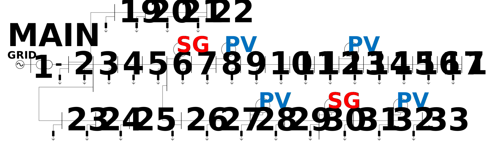

(ieee33pv)=

# Distribution Network Simulation with PV penetration

The following distribution network is composed of 4 PVs and 2 synchronous machines.



To use Solverz for modeling and simulation of the network with PV penetration, one could refer to the codes below.

```{literalinclude} src/plot_pv.py
```

The rationale behind the models can be found in paper[^paper].

We have the PV output/voltage variation as follows.

```{eval-rst}
.. plot:: dae/ieee33pv/src/plot_pv.py
```

[^paper]: W. Liu, W. Gu, P. Li, G. Cao, W. Shi, and W. Liu, “Non-Iterative Semi-Implicit Integration Method for Active Distribution Networks With a High Penetration of Distributed Generations,” IEEE Transactions on Power Systems, vol. 36, no. 1, pp. 438–450, Jan. 2021, doi: 10.1109/TPWRS.2020.3003367.

