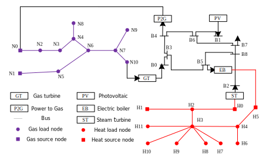

(ies)=

# Integrated Energy System Simulation

Here, we consider the dynamic simulation of the following integrated energy system (IES).



A typical IES consists of three energy subsystems, the electric power system (EPS), the natural gas system (NGS), and the district heating system (DHS), as well as coupling units. In the figure above, the NGS is shown in blue, the EPS in black, and the DHS in red. The specific components of the system are detailed in the legend.

## Modelling

### Electric Power System

The electric power system equations can be modeled in the following form, where the first two equations are network equations and the last two equations represent node power constraints:

$$
\left\{
\begin{aligned}
&i_{x,i} = \sum_{j=1}^{N_b}\left(G_{ij}u_{x,j}-B_{ij}u_{y,j}\right), i\in\mathbb{B}_n\\
&i_{y,i} = \sum_{j=1}^{N_b}\left(G_{ij}u_{y,j}+B_{ij}u_{x,j}\right), i\in\mathbb{B}_n\\
&P_{g,i}-P_{d,i}=u_{x,i}i_{x,i}+u_{y,i}i_{y,i}, i\in\mathbb{B}_n\\
&Q_{g,i}-Q_{d,i}=u_{y,i}i_{x,i}-u_{x,i}i_{y,i}, i\in\mathbb{B}_n
\end{aligned},
\right.
$$

where

- $N_b$ is the number of nodes in the EPS
- $\mathbb{B}_n$ is the set of node indices
- $G_{ij}, B_{ij}$ are the conductance and susceptance between bus $i$ and bus $j$
- $i_{x,i}, i_{y,i}$ are the real and imaginary parts of the current at node $i$
- $u_{x,i}, u_{y,i}$ are the real and imaginary parts of the voltage at node $i$
- $P_{g,i}, P_{d,i}$ are the generation and demand of active power at node $i$
- $Q_{g,i}, Q_{d,i}$ are the generation and demand of reactive power at node $i$

### Natural Gas System

The natural gas system model consists of pipeline equations and network topology equations.

#### Gas pipes

For each pipe, the isothermal gas transmission PDEs are

$$
\left\{
\begin{aligned}
&\frac{\partial p}{\partial t} + \frac{c^2}{S} \frac{\partial q}{\partial x} = 0 \\
&\frac{\partial q}{\partial t} + S \frac{\partial p}{\partial x} + \frac{\lambda c^2 q|q|}{2DSp} = 0
\end{aligned},
\right.
$$

where

- $p$ is the spatial and temporal distribution of pressure
- $q$ is the spatial and temporal distribution of mass flow
- $c$ is the sound velocity
- $S$ is the pipe cross-sectional area
- $\lambda$ is the friction coefficient
- $D$ is the pipe diameter

#### Network Constraints

The network constraints include mass-flow continuity:

$$
\sum_{i\in \mathbb{E}^\text{in}_k} q_i^\text{in}-\sum_{j\in \mathbb{E}^\text{out}_k} q_j^\text{out}=q_k, \quad k\in \mathbb{V},
$$

where

- $q_i^\text{in/out}$ is the inlet or outlet mass flow of pipe $i$
- $\mathbb{E}_k^\text{in/out}$ is the set of edges flowing into or out of node $k$
- $\mathbb{V}$ is the set of nodes
- $q_k$ is the injection mass flow at node $k$

and pressure continuity:

$$
p_k=p^\text{out}_i=p^\text{in}_j,\quad i\in\mathbb{E}_k^\text{out},\ j\in\mathbb{E}_k^\text{in},
$$

where

- $p_k$ is the pressure of node $k$
- $p_i^\text{in/out}$ is the inlet or outlet pressure of pipe $i$

### District Heating System

The district heating system consists of a supply network and a return network. The model contains hydraulic balance, nodal temperature-mixing equations, pipe heat-transport equations, and nodal heat-power equations.

#### Heat pipes

The temperature field $T(x,t)$ in a heat pipe satisfies the one-dimensional advection-loss equation

$$
\frac{\partial T}{\partial t} + \frac{m}{\rho S} \frac{\partial T}{\partial x} + \frac{\lambda}{\rho S C_p} \left( T - T^{\mathrm{amb}} \right) = 0,
$$

where

- $T$ is the water temperature
- $m$ is the pipe mass flow rate
- $\rho$ is the water density
- $S$ is the pipe cross-sectional area
- $C_p$ is the specific heat capacity
- $\lambda$ is the heat-loss coefficient
- $T^{\mathrm{amb}}$ is the ambient temperature

This equation is applied to both the supply-pipe temperature and the return-pipe temperature. If we denote them by $T_s^p(x,t)$ and $T_r^p(x,t)$, then each pipe obeys an equation of the same form.

#### Hydraulic continuity

At each heating node $k$, the pipe mass flows satisfy the hydraulic continuity equation

$$
\sum_{i\in\mathbb{E}^{\mathrm{in}}_k} m_i-
\sum_{j\in\mathbb{E}^{\mathrm{out}}_k} m_j
= m_k^{\mathrm{inj}}, \quad k\in \mathbb{V}
$$

where

- $m_k^{\mathrm{inj}}$ is the nodal injection mass flow rate
- $\mathbb{E}_k^\text{in/out}$ is the set of edges flowing into or out of node $k$
- $\mathbb{V}$ is the set of nodes
- $m_i$ is the mass flow of pipe $i$

#### Loop pressure relation

For the hydraulic loop, the network imposes the algebraic pressure-drop balance

$$
\sum_{i=1}^{N_p} K_i m_i^2\operatorname{sign}(m_i)\,\sigma_i=0,
$$

where

- $K_i$ is the hydraulic resistance coefficient of pipe $i$
- $\sigma_i\in\{-1,0,1\}$ indicates the orientation of that pipe with respect to the selected loop
- $N_p$ is the number of pipes in the selected loop

#### Supply-side temperature mixing

The supply-node temperature is obtained from an energy-weighted mixing relation. In continuous physical form, for node $k$,

$$
T_{s,k}
\left(
\dot m_{k}^{\mathrm{src}}+
\sum_{r\in\mathcal{I}^{\mathrm{sup}}_k} \dot m_{r\to k}
\right)
=
\dot m_{k}^{\mathrm{src}} T_k^{\mathrm{src}}
+
\sum_{r\in\mathcal{I}^{\mathrm{sup}}_k} \dot m_{r\to k} T_{r\to k}^{\mathrm{sup}},
$$

where

- $T_{s,k}$ is the mixed supply temperature at node $k$
- $\dot m_k^{\mathrm{src}}$ is the source or slack injection flow entering the node from a heat source
- $T_k^{\mathrm{src}}$ is the corresponding source temperature
- $\mathcal{I}^{\mathrm{sup}}_k$ is the set of inflowing supply streams
- $T_{r\to k}^{\mathrm{sup}}$ is the temperature of each inflowing supply stream at the node

#### Return-side temperature mixing

Similarly, the return-node temperature satisfies the mixing law

$$
T_{r,k}
\left(
\dot m_k^{\mathrm{load}}+
\sum_{r\in\mathcal{I}^{\mathrm{ret}}_k} \dot m_{r\to k}
\right)
=
\dot m_k^{\mathrm{load}} T_k^{\mathrm{load}}
+
\sum_{r\in\mathcal{I}^{\mathrm{ret}}_k} \dot m_{r\to k} T_{r\to k}^{\mathrm{ret}},
$$

where

- $\dot m_k^{\mathrm{load}}$ is the return-side load flow
- $T_k^{\mathrm{load}}$ is the prescribed load return temperature

#### Nodal heat power

At each node, the thermal power is described by the enthalpy difference between supply and return streams:

$$
\phi_k=C_p\,|m_k|\,(T_{s,k}-T_{r,k})
$$

where

- $\phi_k$ is the thermal power at node $k$
- $C_p$ is the heat capacity of water
- $m_k$ is the mass flow at node $k$
- $T_{s/r,k}$ are the supply and return temperatures at node $k$

For an intermediate node, there is no external heat extraction, so only the hydraulic continuity condition remains.

## Coupling units

- Gas Turbine (GT): We use the classical Rowen gas turbine model [^paper1]. The controller adjusts the input fuel for prescribed exhaust temperature and rotor speed.
- Power to Gas (P2G): Please refer to [^paper2] for the model of P2G.
- Photovoltaic (PV): Please refer to [^paper3] for the model of PV. A detailed PV implementation is also available in this cookbook under DAE Examples/Distribution Network Simulation with PV penetration.
- Electric Boiler (EB): EB is a common heating device used in heating networks. For a specific model, please refer to [^paper4].
- Steam Turbine (ST): The steam turbine model consists of a temperature controller and a steam-volume dynamics module. Details can be found in [^paper5] and [^paper6].

## Solution

### Pipe equation semi-discretization

Mathematically, the entire IES model consists of a complex system of partial differential-algebraic equations. To perform numerical simulations, the natural gas and thermal pipeline PDEs must be discretized or semi-discretized into algebraic equations or ordinary differential equations. Solverz includes multiple pipeline discretization schemes. Balancing accuracy and simulation speed, we typically use the WENO3 semi-discrete scheme [^paper7] for natural gas pipelines and the KT2 scheme [^paper8] for thermal pipelines.

After semi-discretization, the pipe equations take the form

$$
\frac{\mathrm{d} u_j}{\mathrm{d} t} = -\frac{H_{j+1/2} - H_{j-1/2}}{\Delta x} + S(u_j),
$$

where $H_{j+1/2}$ and $H_{j-1/2}$ denote the numerical fluxes at the discrete interfaces $j+1/2$ and $j-1/2$, respectively.

### Numerical integration algorithms

After semi-discretizing the pipeline PDEs, the IES model is transformed into a system of differential-algebraic equations (DAEs). Because the electric, gas, and heating subsystems evolve on different time scales, the resulting model is high-dimensional, nonlinear, and strongly stiff. Solverz integrates a streamlined interface for multiple DAE solvers, among which an improved variable-step Rodas4 algorithm demonstrates strong numerical performance [^paper9].

## Implementation in Solverz

Here presents the Solverz implementation of IES simulation for the system shown above. The structure data `caseI.xlsx` and `case_heat.xlsx` can be found in the related directory of the [source repo](https://github.com/rzyu45/Solverz-Cookbook). `PowerFlow()`, `GasFlow()`, and `DhsFlow()` implement the steady-state calculations for the EPS, NGS, and DHS, respectively, and provide reasonable initial values for the subsequent dynamic simulation. `eps_network()`, `gas_network()`, and `heat_network()` provide simple interfaces for building the dynamic models of the three subnetworks. `gt()`, `eb()`, `pv()`, `st()`, and `p2g()` provide simple interfaces for building the coupling-unit models.

```{literalinclude} src/plot_ies.py
```

The dynamic frequency response after the gas-side disturbance is illustrated below.

```{eval-rst}
.. plot:: dae/ies/src/plot_ies.py
```

[^paper1]: M. R. Bank Tavakoli, B. Vahidi, and W. Gawlik, "An educational guide to extract the parameters of heavy duty gas turbines model in dynamic studies based on operational data," IEEE Trans. Power Syst., vol. 24, no. 3, pp. 1366-1374, 2009.
[^paper2]: J. Fang, Q. Zeng, X. Ai et al., "Dynamic optimal energy flow in the integrated natural gas and electrical power systems," IEEE Trans. Sustain. Energy, vol. 9, no. 1, pp. 188-198, Jan. 2018.
[^paper3]: W. Liu, W. Gu, P. Li, G. Cao, W. Shi, and W. Liu, "Non-Iterative Semi-Implicit Integration Method for Active Distribution Networks With a High Penetration of Distributed Generations," IEEE Transactions on Power Systems, vol. 36, no. 1, pp. 438-450, Jan. 2021.
[^paper4]: X. Liu, J. Wu, N. Jenkins, et al., "Combined Analysis of Electricity and Heat Networks," Applied Energy, vol. 162, pp. 1238-1250, 2016.
[^paper5]: 倪以信, 陈寿孙, 张宝霖. 动态电力系统理论与分析[M]. 北京: 清华大学出版社, 2002.
[^paper6]: S. Lu, Y. Xu, W. Gu, et al., "On Thermal Dynamics Embedded Static Voltage Stability Margin," IEEE Transactions on Power Systems, vol. 38, no. 3, pp. 2982-2985, 2023.
[^paper7]: C.-W. Shu, "Essentially Non-Oscillatory and Weighted Essentially Non-Oscillatory Schemes for Hyperbolic Conservation Laws," in Advanced Numerical Approximation of Nonlinear Hyperbolic Equations, Springer, 1998, pp. 325-432.
[^paper8]: A. Kurganov and E. Tadmor, "New High-Resolution Central Schemes for Nonlinear Conservation Laws and Convection-Diffusion Equations," Journal of Computational Physics, vol. 160, no. 1, pp. 241-282, 2000.
[^paper9]: R. Yu et al., "Quantify gas-to-power fault propagation speed: A semi implicit simulation approach," IEEE Trans. Power Syst., 2025.
