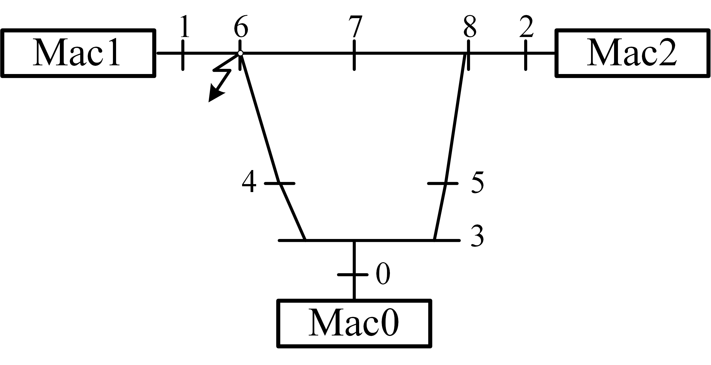

(m3b9)=

# Time-domain Simulation of Electric Power Systems

Synchronous machine is the core of electric power systems. The classic second-order models of the machines are

```{math}
\left\{
    \begin{aligned}
        &\dot{\omega} = \frac{P_\text{m}-P_\text{e}-D(\omega-1)}{T_j}\\
        &\dot{\delta} = (\omega-\omega_\text{COI})\omega_\text{B}\\
        &E_\text{d}'=\sin\delta\qty(U_\text{x}+r_\text{a}I_\text{x}-X_\text{q}'I_\text{y})+\cos\delta\qty(U_\text{y}+r_\text{a}I_\text{y}+X_\text{q}'I_\text{x})\\
        &E_\text{q}'=\cos\delta\qty(U_\text{x}+r_\text{a}I_\text{x}-X_\text{d}'I_\text{y})-\sin\delta\qty(U_\text{y}+r_\text{a}I_\text{y}+X_\text{d}'I_\text{x})\\
        &I_{\text{x},i}-\sum \qty(G_{ij}U_{\text{x},j}-B_{ij}U_{\text{y},j})=0\\
        &I_{\text{y},i}-\sum \qty(G_{ij}U_{\text{y},j}+B_{ij}U_{\text{x},j})=0\\
        &P_\text{e}=U_\text{x}I_\text{x}+U_\text{y}I_\text{y}+\qty(I_\text{x}^2+I_\text{y}^2)r_\text{a}
    \end{aligned}
\right.
```
where $\omega$ is the rotor speed; $\delta$ is the rotor angle; $P_\text{m}$ and $P_\text{e}$ are mechanical and electric power respectively; $T_j$ is the inertial constant; $D$ is the damping coefficient; $\omega_\text{COI}$ is the center-of-inertial rotor speed; $\omega_\text{B}$ is the base synchronous frequency; $E_\text{d}'$ and $E_\text{q}'$ are the d-axis and q-axis transient internal voltages; $U_\text{x}$ and $U_\text{y}$ are respectively the real and imaginary parts of voltages; $I_\text{x}$ and $I_\text{y}$ are respectively the real and imaginary parts of currents; $r_\text{a}$, $X_\text{d}'$ and $X_\text{q}'$ are generator parameters; $G$ and $B$ are respectively the conductance and susceptance matrices.


Below is the diagram of an electric power system with three machines and nine buses.



We want to know, through simulation, if the three machines can keep synchronous in the scenario where the three-phase short-cut fault occurs on bus 6 and is cleared 30ms later. This is a typical security analysis usage of time-domain simulation.

The three-phase short-cut fault can be mathematically interpreted as the surge of node conductance of bus 6.

In Solverz, this can be realized by setting $G_{66}$ as a `TimeSeriesParam`:

```python
m.G66 = TimeSeriesParam('G66',
                        v_series=[G[6, 6], 10000, 10000, G[6, 6], G[6, 6]],
                        time_series=[0, 0.002, 0.03, 0.032, 10])
```
During the fault, the value of $G_{66}$ is set to be 10000 and is restored after having cleared the fault. The time series specify the fault-clearing time.


The Solverz implementation of the above time-domain simulation is as follows wherein the `test_m3b9.xlsx` file can be found in the [directory of the source file](https://github.com/rzyu45/Solverz-Cookbook/tree/main/docs/source/dae/m3b9).

```python
import numpy as np
import pandas as pd
import matplotlib.pyplot as plt

from Solverz import Eqn, Ode, Var, Param, sin, cos, Rodas, Opt, TimeSeriesParam, made_numerical, Model

# %% modelling
m = Model()
m.omega = Var('omega', [1, 1, 1])
m.delta = Var('delta', [0.0625815077879868, 1.06638275203221, 0.944865048677501])
m.Ux = Var('Ux', [1.04000110267534, 1.01157932564567, 1.02160343921907,
                  1.02502063033405, 0.993215117729926, 1.01056073782038,
                  1.02360471178264, 1.01579907336413, 1.03174403980626])
m.Uy = Var('Uy', [9.38510394478286e-07, 0.165293826097057, 0.0833635520284917,
                  -0.0396760163416718, -0.0692587531054159, -0.0651191654677445,
                  0.0665507083524658, 0.0129050646926083, 0.0354351211556429])
m.Ixg = Var('Ixg', [0.688836021737262, 1.57988988391346, 0.817891311823357])
m.Iyg = Var('Iyg', [-0.260077644814056, 0.192406178191528, 0.173047791590276])
m.Pm = Param('Pm', [0.7164, 1.6300, 0.8500])
m.D = Param('D', [10, 10, 10])
m.Tj = Param('Tj', [47.2800, 12.8000, 6.0200])
m.ra = Param('ra', [0.0000, 0.0000, 0.0000])
wb = 376.991118430775
m.Edp = Param('Edp', [0.0000, 0.0000, 0.0000])
m.Eqp = Param('Eqp', [1.05636632091501, 0.788156757672709, 0.767859471854610])
m.Xdp = Param('Xdp', [0.0608, 0.1198, 0.1813])
m.Xqp = Param('Xqp', [0.0969, 0.8645, 1.2578])

Pe = m.Ux[0:3] * m.Ixg + m.Uy[0:3] * m.Iyg + (m.Ixg ** 2 + m.Iyg ** 2) * m.ra
m.rotator_eqn = Ode(name='rotator speed',
                    f=(m.Pm - Pe - m.D * (m.omega - 1)) / m.Tj,
                    diff_var=m.omega)
omega_coi = (m.Tj[0] * m.omega[0] + m.Tj[1] * m.omega[1] + m.Tj[2] * m.omega[2]) / (
        m.Tj[0] + m.Tj[1] + m.Tj[2])
for i in range(3):
    m.__dict__[f'delta_eq{i}'] = Ode(f'Delta equation{i}',
                                     wb * (m.omega[i] - omega_coi),
                                     diff_var=m.delta[i])
m.Ed_prime = Eqn(name='Ed_prime',
                 eqn=(m.Edp - sin(m.delta) * (m.Ux[0:3] + m.ra * m.Ixg - m.Xqp * m.Iyg)
                      + cos(m.delta) * (m.Uy[0:3] + m.ra * m.Iyg + m.Xqp * m.Ixg)))
m.Eq_prime = Eqn(name='Eq_prime',
                 eqn=(m.Eqp - cos(m.delta) * (m.Ux[0:3] + m.ra * m.Ixg - m.Xdp * m.Iyg)
                      - sin(m.delta) * (m.Uy[0:3] + m.ra * m.Iyg + m.Xdp * m.Ixg)))
df = pd.read_excel('test_m3b9.xlsx',
                   sheet_name=None,
                   engine='openpyxl',
                   header=None
                   )
G = np.asarray(df['G'])
B = np.asarray(df['B'])
m.G66 = TimeSeriesParam('G66',
                        [G[6, 6], 10000, 10000, G[6, 6], G[6, 6]],
                        [0, 0.002, 0.03, 0.032, 10])


def getGitem(r, c):
    if r == 6 and c == 6:
        return m.G66
    else:
        return G[r, c]


for i in range(9):
    if i >= 3:
        rhs1 = 0
    else:
        rhs1 = m.Ixg[i]
    for j in range(9):
        rhs1 = rhs1 - getGitem(i, j) * m.Ux[j] + B[i, j] * m.Uy[j]
    m.__dict__[f'Ix_inj_{i}'] = Eqn(f'Ix injection {i}', rhs1)

for i in range(9):
    if i >= 3:
        rhs2 = 0
    else:
        rhs2 = m.Iyg[i]
    for j in range(9):
        rhs2 = rhs2 - getGitem(i, j) * m.Uy[j] - B[i, j] * m.Ux[j]
    m.__dict__[f'Iy_inj_{i}'] = Eqn(f'Iy injection {i}', rhs2)

m3b9, y0 = m.create_instance()

m3b9_dae, code = made_numerical(m3b9, y0, sparse=False, output_code=True)
# %% solution
sol = Rodas(m3b9_dae,
            np.linspace(0, 10, 1001),
            y0,
            Opt(hinit=1e-5))
# %% visualize
plt.plot(sol.T, sol.Y['omega'], label=[f'Machine {i}' for i in range(3)])
plt.xlim([0, 10])
plt.xlabel('Time/s')
plt.ylabel(r'$\omega$')
plt.legend()
plt.grid()
plt.show()

plt.plot(sol.T, sol.Y['delta'], label=[f'Machine {i}' for i in range(3)])
plt.xlim([0, 10])
plt.xlabel('Time/s')
plt.ylabel(r'$\delta$')
plt.legend()
plt.grid()
plt.show()

Vm = (sol.Y['Ux']**2+sol.Y['Uy']**2)**(1/2)
plt.plot(sol.T, Vm, label=[f'Bus {i}' for i in range(9)])
plt.xlim([0, 10])
plt.xlabel('Time/s')
plt.ylabel('Vm')
plt.legend()
plt.grid()
plt.show()

```
We have


We find the system remains stable after the three-phase fault disturbance.
