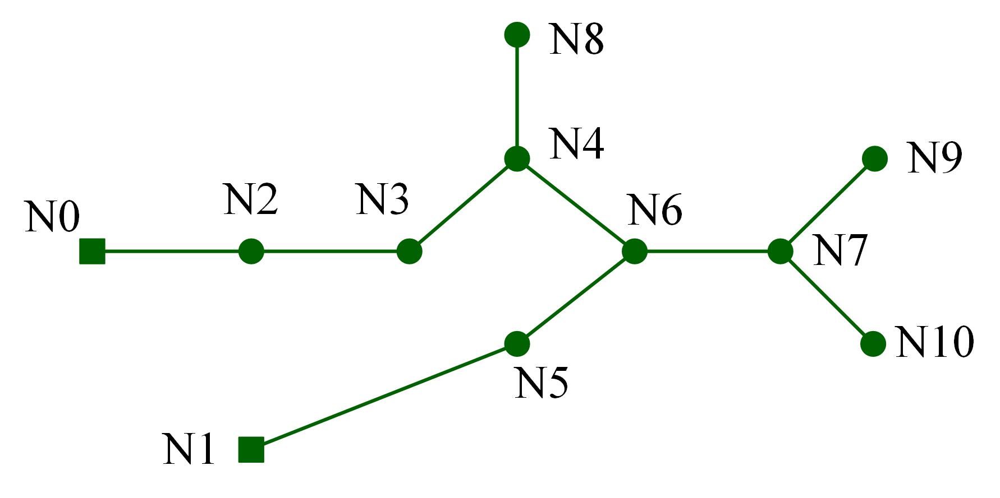
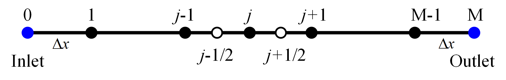

(mol)=

# Method-of-Lines Solution of Network Gas Flow

Here we consider the transmission of gas in the following networks.



The squares are the sources producing gas while the circles are the consumers. The edges denote the pipes in which the gas is transferred. To get an insight into the state transfer of pressure and mass flow, we follow the derivations by Professor Gerd Steinebach[^paper1] which is based on the method-of-lines.

## Modelling

### Gas Pipes

First, we have, for each pipe, the PDEs describing the isothermal gas transmission, with formulae

```{math}
:label: pde_mol
\pdv{p}{t}+\frac{c^2}{S}\pdv{q}{x}=&0,\\
\pdv{q}{t}+S\pdv{p}{x}+\frac{\lambda c^2q|q|}{2DSp}=&0
```

where

- $p$ is the spatial and temporal distribution of pressure
- $q$ is the spatial and temporal distribution of mass flow
- $c$ is the sound velocity
- $S$ is the pipe cross-sectional area
- $\lambda$ is the friction coefficient,
- $D$ is the pipe diameter,

and, suppose we have a pipe with length $L$, the initial conditions

```{math}
p(x, 0)=p_0,\quad q(x,0)=q_0,
```

and the boundary conditions

```{math}
p(0, t)=p_\text{b}(t),\quad q(L,t)=q_\text{b}(t).
```

### Network Constraints

Then there come the network constraints, that is,

the continuity of mass flow

```{math}
\sum_{i\in \mathbb{E}^\text{in}_k} q_i^\text{in}-\sum_{j\in \mathbb{E}^\text{out}_k} q_j^\text{out}=q_k, \quad k\in \mathbb{V}
```

where $q_i^\text{in/out}$ is the inlet/outlet mass flow of pipe $i$. $\mathbb{E}_k^\text{in/out}$ is the set of edges flowing into/out of node $k$. $q_k$ is the injection mass flow of node $k$,

and the continuity of pressure

```{math}
p_k=p^\text{out}_i=p^\text{in}_j,\quad i\in\mathbb{E}_k^\text{out},\ j\in\mathbb{E}_k^\text{in},
```

where $p_k$ is the pressure of node $k$, $p_i^\text{in/out}$ is the inlet/outlet pressure of pipe $i$.

## Solution

### The Method of Lines

The method of lines does the semidiscretization of PDEs for a system of ODEs. First, the PDE systems {eq}`pde_mol` are summarized by

```{math}
    \pdv{u}{t}+\pdv{f(u)}{x}=S(u), \quad x\in [0, L].
    \label{hyperbolicpde}
```

with state vector $u$, flux function $f(u)$ and source term $S(u)$. The space interval is discretized into $0=x_0<x_1<\cdots<x_{M-1}<x_M=L$ with constant step size $\Delta x=x_{j+1}-x_{j}$.



The space derivatives are approximated by $\pdv{f(u)}{x}=\frac{f_{i+1/2}-f_{i-1/2}}{\Delta x}$ with suitable chosen flux values $f_{i\pm 1/2}$ leading to the semi-discretized system of ODEs

```{math}
    \dv{u_j}{t}+\frac{f_{j+1/2}-f_{j-1/2}}{\Delta x}=S(u_j), \quad j=1,\cdots,M-1.
```

The methods to get stable discretizations have been well studied. Here, a local Lax-Friedrichs approach is applied:

```{math}
f_{j+1 / 2}=\frac{1}{2}\left(f_{j+1 / 2}^{+}+f_{j+1 / 2}^{-}-\left|\lambda_{j+1 / 2}\right|\left(u_{j+1 / 2}^{+}-u_{j+1 / 2}^{-}\right)\right).
```

We put

```{math}
\lambda_{j+1/2}=\rho\qty(\dv{f}{x})
```

where $\rho$ is the spectral radius of $\dv{f}{x}$. In the above case, it would be $c$ since

```{math}
A\triangleq \pdv{f(u)}{x}=
\begin{bmatrix}
\boldsymbol{0}&\frac{c^2}{S}\\  
S&\boldsymbol{0}  
\end{bmatrix},
```

```{math}
|\lambda I-A|=\lambda^2 - c^2=0,
```

and

```{math}
\lambda =\pm c.
```

We would recommend the books of Professor Hirsch[^text1] and Professor Bertoluzza[^text2] for detailed derivation. However, we found that in the linear case, to set $\lambda_{j+1/2}$ lowers the accuracy. We can just put $\lambda_{j+1/2}=0$ here.

The first order discretization is given by the choice

```{math}
f_{j+1/2}^+=f(u_{j+1}),\quad f_{j+1/2}^-=f(u_j), \quad, u_{j+1 / 2}^{+}=u_{j+1}, \quad, u_{j+1 / 2}^{-}=u_{j}, \quad j=1,\cdots,M-1.
```

$f_{j-1/2}$ can be obatined by moving the stencil one $\Delta x$ left. Higher order can be achieved by the Kurganov-Tadmor[^paper2] or the WENO method[^text3].

### Numerical Boundaries

The above semi-discretization uses a three-point stencil. However, for $p$ and $q$ at the boundary, i.e., $p_M$ and $q_0$, we ought to derive the numerical boundaries, which are algebraic equations, to finally complement the equations.

Perform the eigendecomposition of $A$, we have

```{math}
A v=v\Lambda.
```

Hence, we have

```{math}
v^{-1}\pdv{u}{t}+\Lambda v^{-1}\pdv{u}{x}=v^{-1}S(u),
```

where

```{math}
v^{-1}=
\begin{bmatrix}
    \frac{S}{2c}&\frac{1}{2}\\
    -\frac{S}{2c}&\frac{1}{2}
\end{bmatrix}\ \text{and}\
\Lambda=
\begin{bmatrix}
    c&0\\
    0&-c
\end{bmatrix}.
```

Letting

```{math}
\delta w=v^{-1}\delta u=\begin{bmatrix}
\frac{S}{2c}\delta p+\frac{1}{2}\delta q\\
-\frac{S}{2c}\delta p+\frac{1}{2}\delta q 
\end{bmatrix}
```

we have

```{math}
\pdv{w}{t}+\Lambda\pdv{w}{x}=v^{-1}S(u).
```

Neglecting the source term, we have

```{math}
\dv{w}{t}=0.
```

That is, *Riemann variable* $w_1$ is invariant along the path line $\dv*{x}{t}=c$ and $w_2$ is invariant along the path line $\dv*{x}{t}=-c$.

Two characteristics are defined as

```{math}
\begin{aligned}
\text{On}\ C_+\text{:}\quad& \dv{x}{t}=c,\\
\text{On}\ C_-\text{:}\quad& \dv{x}{t}=-c.
\end{aligned}
```

Integrating $w_1$ along $c_+$, we have

```{math}
w_1=\int\frac{S}{2c}\delta p+\int\frac{1}{2}\delta q=\frac{S}{2c}p+\frac{1}{2}q.
```

Similarly,

```{math}
w_2=-\frac{S}{2c}p+\frac{1}{2}q.
```

To obtain the right numerical boundary condition, we have to use the invariant $\frac{S}{2c}p+\frac{1}{2}q$ along $C_+$ for its pointing to the right boundary.

Letting

```{math}
S p+c q\triangleq  I_M(x,t),
```

we have

```{math}
 I_M(x_M,t_1)= I_M(x_{M-1},t)\quad \text{where}\quad t_1=\frac{\Delta x}{c}+t,
```

```{math}
 I_M(x_M,t_2)= I_M(x_{M-2},t)\quad \text{where}\quad t_2=\frac{2\Delta x}{c}+t.
```

By linear extrapolation, we have

```{math}

     I_M(x_\text{M},t)=\frac{ I_M(x_M,t_2)- I_M(x_M,t_1)}{t_2-t_1}(t-t_1)+ I_M(x_M,t_1)=
    2 I_M(x_{M-1},t)- I_M(x_{M-2},t).

```

Similarly, we have

```{math}

    I_0(x_0,t)=
    2I_0(x_1,t)-I_0(x_2,t).

```

Finally, we have numerical boundary conditions, for $p_M$,

```{math}
 p_M+\frac{c}{S} q_M+\qty( p_{M-2}+\frac{c}{S} q_{M-2})-2\qty( p_{M-1}+\frac{c}{S} q_{M-1})=0.
```

Similarly, we have, for $q_0$,

```{math}
\qty(\frac{S}{c} p_2- q_2)+\frac{S}{c} p_0- q_0-2\qty(\frac{S}{c} p_1- q_1)=0.
```

## Implementation in Solverz

Here presents the Solverz implementation of method-of-lines with respect to the gas network at the very beginning. The data for initialization, the `steady_gas_flow_model.pkl`, can be found in related directory of the [source repo](https://github.com/rzyu45/Solverz-Cookbook).

We want to see the impacts of source pressure increase, so we set `Piset0` as a `TimeSeriesParam`.

```{literalinclude} src/plot_mol.py
```

We illustrate the variation of node pressure as follows.

```{eval-rst}
.. plot:: dae/mol/src/plot_mol.py
```

[^paper1]: Steinebach, G., Dreistadt, D.M. (2021). Water and Hydrogen Flow in Networks: Modelling and Numerical Solution by ROW Methods. In: Jax, T., Bartel, A., Ehrhardt, M., Günther, M., Steinebach, G. (eds) Rosenbrock—Wanner–Type Methods. Mathematics Online First Collections. Springer, Cham. https://doi.org/10.1007/978-3-030-76810-2_2
[^text1]: C. Hirsch, Numerical Computation of Internal and External Flows, Volume 2: Computational Methods for Inviscid and Viscous Flows. West Sussex, England: John Wiley & Sons, 1990.
[^text2]: Silvia Bertoluzza, Giovanni Russo, Silvia Falletta, Chi-Wang Shu (2009). Numerical Solutions of Partial Differential Equations. Birkhäuser Basel. https://doi.org/10.1007/978-3-7643-8940-6
[^text3]: C.-W. Shu, “Essentially non-oscillatory and weighted essentially non- oscillatory schemes for hyperbolic conservation laws,” in Advanced Numerical Approximation of Nonlinear Hyperbolic Equations: Lectures given at the 2nd Session of the Centro Internazionale Matematico Estivo (C.I.M.E.) held in Cetraro, Italy, June 23–28, 1997, A. Quarteroni, Ed. Berlin, Heidelberg: Springer Berlin Heidelberg, 1998, pp. 325–432.
[^paper2]: Alexander Kurganov, Eitan Tadmor, New High-Resolution Central Schemes for Nonlinear Conservation Laws and Convection–Diffusion Equations, Journal of Computational Physics, Volume 160, Issue 1, 2000, Pages 241-282, https://doi.org/10.1006/jcph.2000.6459
