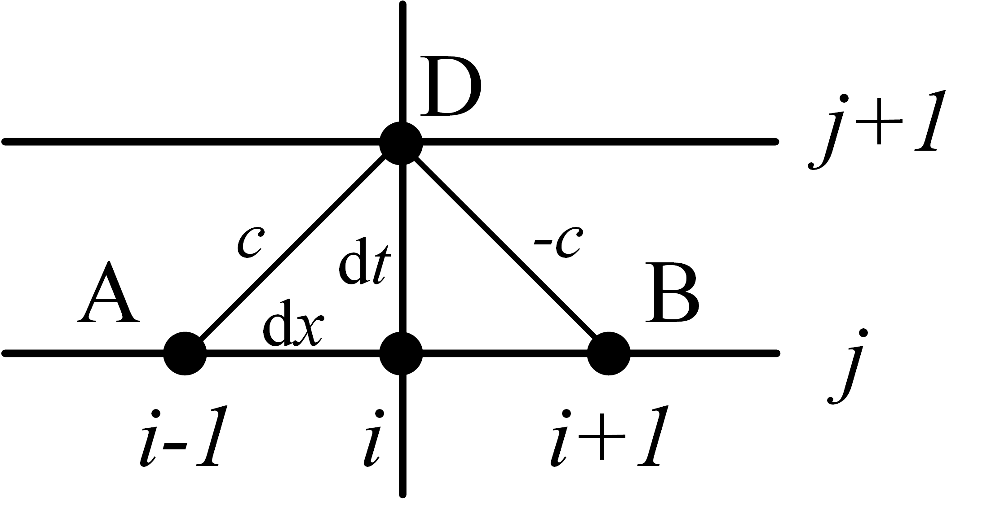
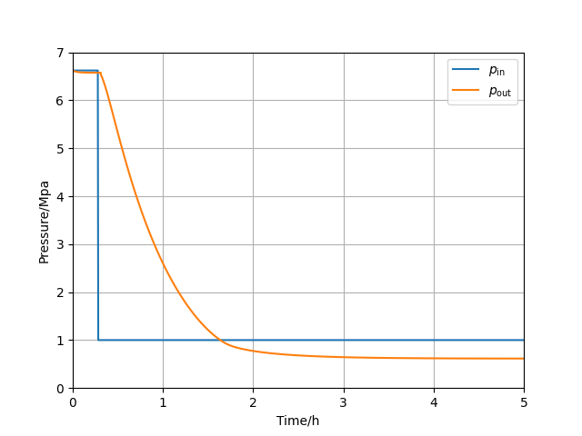

(cha)=

# Solving Gas Transmission PDEs using Characteristics

The hyperbolic partial differential equations (PDEs) describing the conservation of isothermal gas transmission are
```{math}
:label: pde0
\pdv{p}{t}+\frac{c^2}{S}\pdv{q}{x}=&0,\\
\pdv{q}{t}+S\pdv{p}{x}+\frac{\lambda c^2q|q|}{2DSp}=&0
```
where 
- $p$ is the spatial and temporal distribution of pressure
- $q$ is the spatial and temporal distribution of mass flow, 
- $c$ is the sound velocity, 
- $S$ is the pipe cross-sectional area, 
- $\lambda$ is the friction coefficient,
- $D$ is the pipe diameter,

Suppose we have, for a pipe with length $L$, the initial conditions

```{math}
p(x, 0)=p_0,\quad q(x,0)=q_0,
```

and the boundary conditions

```{math}
p(0, t)=pb(t),\quad q(L,t)=qb(t),
```

we use the method of characteristics to solve solutions of the above PDEs numerically.

Rewrite {eq}`pde0` as

```{math}
:label: pde1
    \pdv{t}
    \begin{bmatrix}
    p\\
    q
    \end{bmatrix}
    +
    \begin{bmatrix}
    0&c^2/S\\
    S&0
    \end{bmatrix}
    \pdv{x}
    \begin{bmatrix}
    p\\
    q
    \end{bmatrix}
    =
    \begin{bmatrix}
    0\\
    -\frac{\lambda c^2q|q|}{2DSp}
    \end{bmatrix}
```
wherein the matrix can be diagonalized as

```{math}
\begin{bmatrix}
0&c^2/S\\
S&0
\end{bmatrix}=
\begin{bmatrix} \frac{c}{S} & -\frac{c}{S}\\ 1 & 1 \end{bmatrix}
\begin{bmatrix} c & 0\\ 0 & -c \end{bmatrix}
\begin{bmatrix} \frac{S}{2c} & \frac{1}{2}\\ -\frac{S}{2c} & \frac{1}{2} \end{bmatrix}.
```

Multiplying $P^{-1}$ to both sides of {eq}`pde1`, we have
```{math}
    \pdv{t}
    \begin{bmatrix}
\frac{S}{2c} p+\frac{1}{2}q\\
-\frac{S}{2c} p+\frac{1}{2}q 
\end{bmatrix}
    +
    \begin{bmatrix}
    c&0\\
    0&-c
    \end{bmatrix}
    \pdv{x}
    \begin{bmatrix}
\frac{S}{2c} p+\frac{1}{2}q\\
-\frac{S}{2c} p+\frac{1}{2}q 
\end{bmatrix}
    +
    \begin{bmatrix}
    \frac{\lambda c^2q|q|}{4DSp}\\
    \frac{\lambda c^2q|q|}{4DSp}
    \end{bmatrix}
    =
    0,
```
which can also be written as the total derivative forms with formulae

```{math}
:label: pde2
\dv{t}\qty(\frac{S}{2c} p+\frac{1}{2}q)+\dv{x}\qty(\frac{S}{2c} p+\frac{1}{2}q)\dv{x}{t}+\frac{\lambda c^2q|q|}{4DSp}=0\\
\dv{x}{t}=c,
```

and

```{math}
\dv{t}\qty(-\frac{S}{2c} p+\frac{1}{2}q )+\dv{x}\qty(-\frac{S}{2c} p+\frac{1}{2}q )\dv{x}{t}+\frac{\lambda c^2q|q|}{4DSp}=0\\
\dv{x}{t}=-c.
```

Multiplying $\dd t$ to both sides of {eq}`pde2`, we have

```{math}
:label: ode1
\dd{\qty(\frac{S}{c} p)}+\dd{q}+\frac{\lambda cq|q|}{4DSp}\dd x=0,
```

which holds ***only along the characteristic $\dd x/\dd t=c$***.

Similarly, we have, ***along the characteristic $\dd x/\dd t=-c$***,

```{math}
\dd{\qty(-\frac{S}{c} p)}+\dd{q}+\frac{\lambda cq|q|}{4DSp}\dd x=0.
```

Given difference stencil 

{:height="50%" width="50%"}

we can integrate {eq}`ode1` along A to D, and approximate the $q|q|/p$ term by $(q_A+q_D)|q_A+q_D|/(p_A+p_D)$.

Then we obtain 

```{math}
p_D-p_A+\frac{c}{S}\qty(q_D-q_A)+\frac{\lambda c^2(q_A+q_D)|q_A+q_D|\dd x}{4DS^2\qty(p_A+p_D)}=0.
```

Similarly,
```{math}
p_B-p_D+\frac{c}{S}\qty(q_D-q_B)+\frac{\lambda c^2(q_B+q_D)|q_B+q_D|\dd x}{4DS^2\qty(p_B+p_D)}=0.
```


If we divided the total pipe length into $M$ sections, we finally have the finite difference algebraic equations

```{math}
p_i^{j+1}-p_{i-1}^j+\frac{c}{S}\left(q_i^{j+1}-q_{i-1}^j\right)+\frac{\lambda c^2 \Delta x}{4 D S^2} \frac{\left(q_i^{j+1}+q_{i-1}^j\right)^2}{p_i^{j+1}+p_{i-1}^j}&=0,\quad 1\leq i\leq M,\\
p_{i+1}^j-p_i^{j+1}+\frac{c}{S}\left(q_i^{j+1}-q_{i+1}^j\right)+\frac{\lambda c^2 \Delta x}{4 D S^2} \frac{\left(q_i^{j+1}+q_{i+1}^j\right)^2}{p_i^{j+1}+p_{i+1}^j}&=0,\quad 0\leq i\leq M-1.
```

The following codes is the Solverz implementation of the characteristics.
```python
import matplotlib.pyplot as plt
import numpy as np
from sympy import Integer

from Solverz import (Var, Param, Eqn, Opt, Abs,
                     made_numerical, TimeSeriesParam, Model, AliasVar, fdae_solver)

# %% mdl
L = 51000 * 0.8
p0 = 6621246.69079594
q0 = 14

va = Integer(340)
D = 0.5901
S = np.pi * (D / 2) ** 2
lam = 0.03

dx = 500
dt = 1.4706
M = int(L / dx)
m1 = Model()
m1.p = Var('p', value=p0 * np.ones((M + 1,)))
m1.q = Var('q', value=q0 * np.ones((M + 1,)))
m1.p0 = AliasVar('p', init=m1.p)
m1.q0 = AliasVar('q', init=m1.q)

m1.ae1 = Eqn('cha1',
             m1.p[1:M+1] - m1.p0[0:M] + va / S * (m1.q[1:M+1] - m1.q0[0:M]) + 
             lam * va ** 2 * dx / (4 * D * S ** 2) * (m1.q[1:M+1] + m1.q0[0:M]) * Abs(m1.q[1:M+1] + m1.q0[0:M]) / (m1.p[1:M+1] + m1.p0[0:M]))

m1.ae2 = Eqn('cha2',
             m1.p0[1:M+1] - m1.p[0:M] + va / S * (m1.q[0:M] - m1.q0[1:M+1]) + 
             lam * va ** 2 * dx / (4 * D * S ** 2) * (m1.q[0:M] + m1.q0[1:M+1]) * Abs(m1.q[0:M] + m1.q0[1:M+1]) / (m1.p[0:M] + m1.p0[1:M+1]))
T = 5 * 3600
pb1 = 1e6
pb0 = 6621246.69079594
pb_t = [pb0, pb0, pb1, pb1]
tseries = [0, 1000, 1000 + 10*dt, T]
m1.pb = TimeSeriesParam('pb',
                        v_series=pb_t,
                        time_series=tseries)
m1.qb = Param('qb', q0)
m1.bd1 = Eqn('bd1', m1.p[0] - m1.pb)
m1.bd2 = Eqn('bd2', m1.q[M] - m1.qb)
fdae, y0 = m1.create_instance()
nfdae, code = made_numerical(fdae, y0, sparse=True, output_code=True)

# %% solution
sol = fdae_solver(nfdae, [0, T], y0, Opt(step_size=dt))

# %% visualize
plt.plot(sol.T/3600, sol.Y['p'][:, 0], label=r'$p_\text{in}$')
plt.plot(sol.T/3600, sol.Y['p'][:, -1], label=r'$p_\text{out}$')
plt.xlim([0, 5])
plt.legend()
plt.grid()
plt.show()

```
Finally, we have

